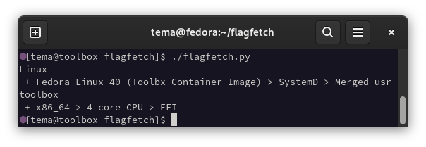

# flagfetch

Flagfetch is a **dynamic** fetch utility that is trying to be compact and ship with zero dependencies (except Python).

## Example output

## Customizing
I made the source code quite readable, so anybody can modify it to get what they need.

## License
Licensed under WTFPL. Read [license](license) file for additional information.
