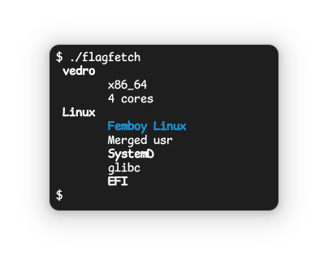

# flagfetch

Flagfetch is a **dynamic** fetch utility that is trying to be compact and ship with zero dependencies (except Python).

## License
Licensed under WTFPL. Read [license](license) file for additional information.